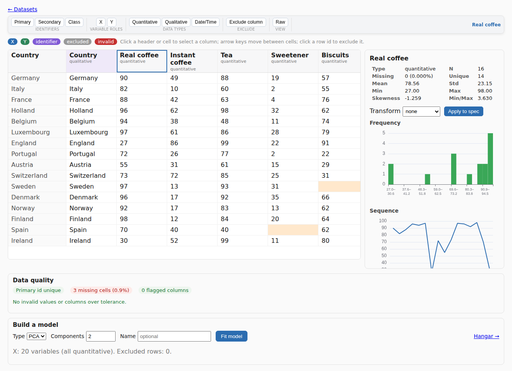
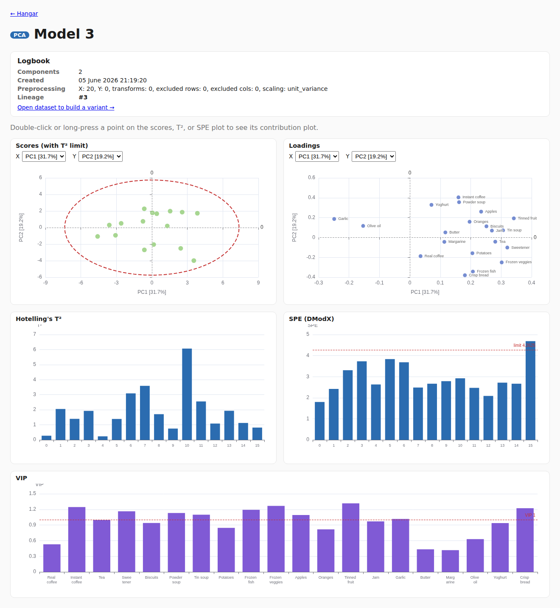

# ScorePilot

[](https://github.com/kgdunn/ScorePilot/actions/workflows/ci.yml)
[](LICENSE)
[](https://www.python.org/)

**Build, compare, and interrogate PCA and PLS models in your browser.** ScorePilot is
a point-and-click workbench for multivariate data analysis and chemometrics: load a
table, clean it up, fit a model, and explore the scores, loadings, and diagnostics
that explain your process - no code required.

It runs as a single, self-contained app you launch with one command. Standard
chemometrics terms keep their established names throughout: scores (T), loadings (P),
Hotelling's T², SPE/DModX, contributions, VIP, R²X / R²Y, Q².

---

## See it in action

**Explore your data** - a fast spreadsheet-style grid with a live inspector for every
column (distribution, sequence, summary, transform preview), data-quality flags, and
one-click roles and exclusions:



**Fit a model and read it** - scores with the Hotelling's T² confidence ellipse,
loadings, T² and SPE with control limits, and VIP, all interactive:



---

## What you can do

- **Bring in data your way** - upload a CSV or Excel file, paste a public URL, or start
  from one of the bundled example datasets (LDPE, food consumption, solvents, NIR tablet
  spectra, and more).
- **Understand each variable** - click any column to see its histogram, run-order
  sequence, and summary statistics, and preview a transform (log, logit, ...) before you
  commit to it. Toggle the whole grid between raw and autoscaled values.
- **Clean and shape the workset** - set the primary identifier (auto-detected, with a
  synthetic row id when needed), mark X / Y variables, and exclude outlying samples or
  unwanted variables - all without altering your original data.
- **Catch problems early** - duplicate identifiers, non-numeric values in numeric
  columns, and missing data are flagged as you go.
- **Fit PCA and PLS** - choose the number of components and fit. For one-component models
  the plots collapse to a single, readable axis automatically.
- **Interrogate the model** - plot any pair of components (or sequence order), hover a
  score to read its SPE and T², and double-click or long-press any point to open its
  **contribution plot** and see which variables drive it.
- **Keep a history** - every model variant lands in the **Hangar**, and each one carries
  a **Logbook** recording its preprocessing, exclusions, and lineage, so you can branch a
  new variant from an existing one and compare.

Your datasets and models are saved, so they survive a restart and are there when you
come back.

---

## Quick start

You need Python 3.12+ and [uv](https://docs.astral.sh/uv/). Then:

```bash
uv run scorepilot
```

That boots the app and opens your browser at `http://127.0.0.1:8000`. Load a sample
dataset from the home page and start exploring.

Handy flags:

```bash
uv run scorepilot --host 0.0.0.0 --port 8080 --no-browser
```

> The packaged app is a single process with no Node required at runtime: the Python
> server hosts both the API and the web UI.

---

## The assistant (optional)

ScorePilot has an optional in-app assistant, **T²-D2**, for help interpreting a model.
It is **off by default**, bring-your-own-key, and the analysis never depends on it - the
tool is fully usable without it.

---

## For developers

ScorePilot is a FastAPI + SQLAlchemy backend with a SvelteKit (Svelte 5) + ECharts
frontend, wrapping the [`process-improve`](https://github.com/kgdunn/process_improve)
chemometrics library for the numerics. The numerical `core/` is pure and has no web or
database imports.

- Architecture, the dataset / preprocessing-spec model, and the reusable data grid:
  [`docs/ARCHITECTURE.md`](docs/ARCHITECTURE.md)
- A from-scratch local setup walkthrough: [`docs/DEVELOPMENT.md`](docs/DEVELOPMENT.md)
- Deployment and publishing: [`docs/DEPLOYMENT.md`](docs/DEPLOYMENT.md),
  [`docs/PUBLISHING.md`](docs/PUBLISHING.md)

Common tasks:

```bash
uv sync                 # set up the environment
uv run scorepilot       # run the app
uv run pytest           # tests
uv run ruff check .     # lint
uv run pyright          # type check

cd frontend && npm install && npm run dev   # frontend dev server (proxies /api)
```

---

## License

MIT. See [LICENSE](LICENSE).
